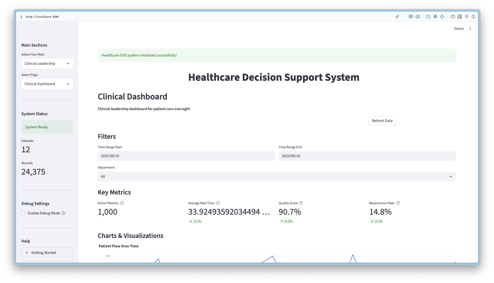

# Healthcare Decision Support System (DSS)

A comprehensive healthcare decision support system designed for capacity planning, resource optimization, and clinical decision-making using machine learning and data analytics.

## Features

- **Data Management**: Healthcare dataset processing and quality assessment
- **Machine Learning**: Multiple ML algorithms (Random Forest, XGBoost, LightGBM, SVM)
- **Clinical Decision Support**: Rule-based recommendations and risk assessment
- **Interactive Dashboard**: Streamlit-based web interface with role-based access
- **Analytics**: Classification, clustering, time series, and prescriptive analytics

## Role-Based Dashboard Views

The Healthcare DSS provides specialized dashboards for different user roles:

### Clinical Leadership Dashboard

*Comprehensive clinical oversight with patient flow management, quality metrics, and resource allocation*

### Administrative Executive Dashboard  

*Strategic planning, performance management, and regulatory compliance tools*

### Clinical Staff Dashboard

*Patient care tools, clinical decision support, and treatment recommendations*

### Department Manager Dashboard

*Staff scheduling, resource utilization, and department performance metrics*

### Financial Manager Dashboard

*Cost analysis, budget tracking, revenue forecasting, and financial risk assessment*

## Quick Start

1. **Install dependencies:**
```bash
pip install -r requirements.txt
```

2. **Run demo:**
```bash
python3 main.py --mode demo
```

3. **Launch dashboard:**
```bash
python3 main.py --mode dashboard
# Access at http://localhost:8501
```

## Available Modes

- `demo` - Comprehensive system demonstration
- `methodology` - Herbert Simon's Four-Phase Decision-Making Model
- `dashboard` - Interactive web dashboard
- `workflow` - CRISP-DM workflow demonstration
- `clinical` - Clinical decision support demonstration

## Datasets

### Real Healthcare Datasets
- **Diabetes** (442 patients) - Disease progression prediction
- **Breast Cancer** (569 patients) - Cancer diagnosis
- **Healthcare Expenditure** (16 countries, 2015-2022) - Global analysis
- **Wine** (178 samples) - Medical research applications
- **Linnerud** (20 individuals) - Physiological measurements

### Synthetic Healthcare Datasets
- **Patient Demographics** (1,000 patients) - Patient characteristics and vitals
- **Clinical Outcomes** (1,000 patients) - Treatment success and satisfaction
- **Staff Performance** (200 staff) - Healthcare worker metrics
- **Financial Metrics** (24 months) - Revenue, expenses, and KPIs
- **Department Performance** (7 departments) - Department efficiency metrics
- **Hospital Capacity** - Bed allocation and resource utilization
- **Medication Effectiveness** - Drug response and outcomes

## Project Structure

```
healthcare_dss/
├── core/           # Data, Model, Knowledge Management
├── analytics/      # ML algorithms and analytics
├── ui/            # Streamlit dashboard
├── utils/         # Utilities and workflows
└── config/        # Configuration
```

## Testing

```bash
python3 -m pytest tests/ -v
```

Run comprehensive tests:
```bash
python3 tests/test_runner.py --comprehensive
```